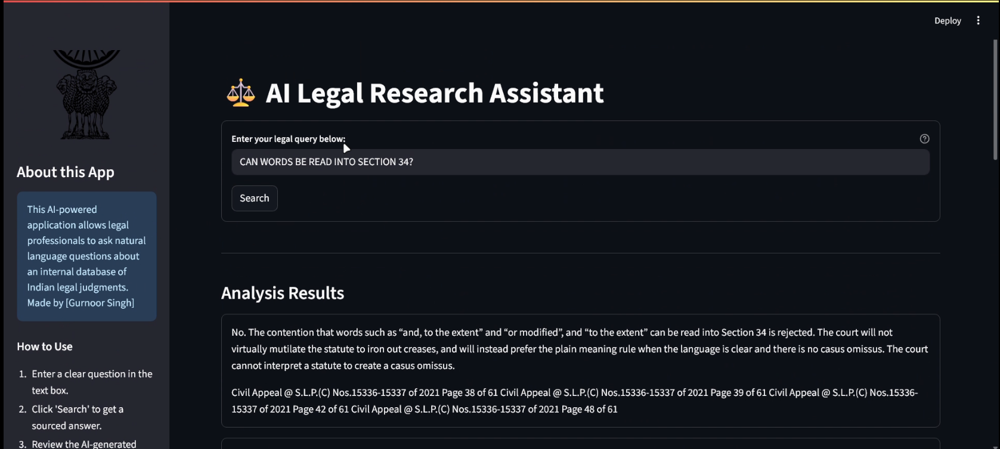

# ⚖️ AI Legal Research Assistant

An advanced AI-powered application designed for legal professionals to conduct efficient, sourced legal research using a private knowledge base of court judgments. Built with Python, LangChain, Google Gemini, and Qdrant.

## Overview

This project implements a Retrieval-Augmented Generation (RAG) system that allows users to ask natural language questions about a private collection of legal documents. The AI provides precise, context-aware answers and cites the specific source documents used, streamlining the research process and improving productivity for law firms.


*(Suggestion: Run the app, take a nice screenshot, save it as `screenshot.png` inside the `assets` folder)*

## Features

-   **Natural Language Queries**: Ask complex questions just like you would to a human assistant.
-   **Sourced Answers**: Every answer is backed by citations from the original documents, ensuring verifiability.
-   **Private Knowledge Base**: The AI only uses your private, uploaded legal documents, guaranteeing data privacy.
-   **Interactive UI**: A clean and professional user interface built with Streamlit.

## Tech Stack

-   **Orchestration**: LangChain
-   **LLM**: Google Gemini Pro (via API)
-   **Vector Database**: Qdrant Cloud
-   **Embeddings**: Google's `embedding-001` model
-   **UI**: Streamlit
-   **Core Language**: Python

## Setup and Installation

Follow these steps to set up and run the project locally.

### Prerequisites

-   Python 3.9+
-   Git
-   A Qdrant Cloud account (free tier is sufficient)
-   A Google AI Studio API Key

### Installation Guide

1.  **Clone the repository:**
    ```bash
    git clone https://github.com/[YOUR_GITHUB_USERNAME]/[YOUR_REPOSITORY_NAME].git
    cd [YOUR_REPOSITORY_NAME]
    ```

2.  **Create and activate a virtual environment:**
    ```bash
    # For Windows
    python -m venv venv
    venv\Scripts\activate

    # For macOS/Linux
    python3 -m venv venv
    source venv/bin/activate
    ```

3.  **Install the required dependencies:**
    ```bash
    pip install -r requirements.txt
    ```

4.  **Set up your environment variables:**
    -   Create a new file named `.env` in the root of the project.
    -   Copy the contents of `.env.example` into it.
    -   Fill in your actual API keys and Qdrant URL in the `.env` file.

## Usage

The project is run in two stages: data ingestion and application execution.

### 1. Data Ingestion

First, you must process your legal documents and load them into the vector database.

-   Place all your legal judgment PDFs inside the `data/` folder.
-   Run the ingestion script:
    ```bash
    python ingest.py
    ```
    This will process the PDFs, create embeddings, and upload them to your Qdrant collection.

### 2. Running the Application

Once ingestion is complete, you can start the user-facing application.

-   Run the Streamlit app:
    ```bash
    streamlit run app.py
    ```
-   Open your web browser and navigate to the local URL provided (usually `http://localhost:8501`).

## Troubleshooting

-   **`RuntimeError: There is no current event loop`**: This is a common issue on Windows. The current `app.py` includes a fix using `nest_asyncio`. Ensure you have run `pip install -r requirements.txt`.
-   **`404 models/... is not found`**: Your Google API key may not have access to the specific model version in `app.py`. Run the `check_models.py` script to see a list of your available models and update the model name in `app.py` accordingly.
-   **"Cannot find an answer" errors**: This usually indicates a problem with the data ingestion or retrieval.
    1.  Ensure your PDFs have selectable text, not just scanned images.
    2.  Try asking more specific questions.
    3.  Consider running `ingest.py` again to re-index your documents.

## License

This project is licensed under the MIT License. See the `LICENSE` file for details.